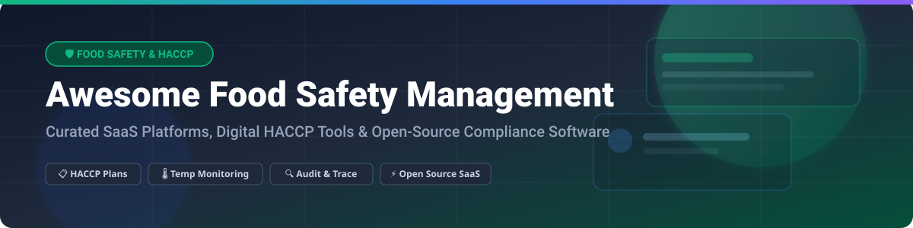

# 🛡️ Awesome Food Safety Management

## 📌 Overview & Ecosystem Analysis

A curated list of **Food Safety Management Systems (FSMS)**, **digital HACCP software**, **temperature monitoring IoT solutions**, **quality compliance platforms**, and **open-source food safety tools** for food manufacturers, processors, restaurants, and supply chain operators.

> **💡 Market Size & Industry Structure:**  
> The global **Food Safety Management Software market** is estimated at **$18.5 Billion to $22.0 Billion** (growing at ~11.5% CAGR). The market is **moderately fragmented**, featuring legacy enterprise EHSQ conglomerates (Fortive/Intelex, Veralto/TraceGains), specialized mid-market food compliance platforms (Safefood 360°, FoodLogiQ), and emerging cloud-native mobile-first software providers (FoodDocs).

---

## 📚 Table of Contents
- [🏢 SaaS / Hosted Platforms](#-saas--hosted-platforms)
- [🔓 Open-Source GitHub Projects](#-open-source-github-projects)
- [📈 Star History](#-star-history)
- [🤝 How to Contribute](#-how-to-contribute)
- [💖 Support & Sponsorship](#-support--sponsorship)
- [⚠️ Disclaimer](#-disclaimer)

---

## 🏢 SaaS / Hosted Platforms

Below is a breakdown of top commercial Food Safety Management SaaS platforms, sorted by estimated company scale (annual revenue/valuation):

| 🏢 Platform | 💰 Starting Price | 🆓 Free Tier / Trial Limit | 📊 Company Scale (Revenue / Valuation) | 🎯 Core Focus & Features |
| :--- | :--- | :--- | :--- | :--- |
| **[Intelex Food Safety](https://www.intelex.com/)** | Custom quote (~$10,000+/yr) | Demo request only (No free trial) | **~$144M ARR** ($570M Valuation by Fortive) | Enterprise EHSQ, automated audit workflows, supplier quality, and multi-facility compliance. |
| **[TraceGains](https://www.tracegains.com/)** | Custom quote (~$5,000+/yr) | Demo request only (No free trial) | **~$15.5M ARR** ($350M Valuation by Veralto) | Supplier document management, ingredient marketplace, supply chain hazard intelligence. |
| **[FoodLogiQ](https://www.foodlogiq.com/)** | Custom quote (~$3,000+/yr) | Demo request only (No free trial) | **~$10M–$50M ARR** (Acquired by Riverside Co.) | Food traceability (FSMA 204), recall management, and supply chain risk evaluation. |
| **[Safefood 360°](https://safefood360.com/)** | Custom quote (~$2,400+/yr) | Demo request only (No free trial) | **~$3.2M ARR** (Part of LGC Assure Group) | Enterprise HACCP plan management, corrective actions (CAPA), audit readiness. |
| **[ComplianceMate](https://compliancemate.com/)** | **$69 / location / month** | Demo request only (No free trial) | **~$2.9M ARR** (Backed by Ladle / Nexa Equity) | IoT sensor cold-chain temperature logs, real-time alerts, daily checklist workflows. |
| **[FoodDocs](https://www.fooddocs.com/)** | **$84 / site / month** | **14-day Free Trial** (No credit card required) | **~$1.0M ARR** ($2.7M raised) | AI-powered digital HACCP plan generator, customizable monitoring sheets, mobile logs. |

---

## 🔓 Open-Source GitHub Projects

Open-source alternatives, self-hosted checklist tools, IoT logging engines, and public recall analytics tools, sorted by **GitHub Stars_Count (descending)**:

* **[n8n](https://github.com/n8n-io/n8n)**   
  Fair-code workflow automation node engine used for integrating food temperature sensors, audit alert dispatching, and automated HACCP task escalation.
* **[Appsmith](https://github.com/appsmithorg/appsmith)**   
  Low-code framework popular for building custom internal HACCP dashboards, inspection forms, and lot traceability trackers.
* **[ToolJet](https://github.com/ToolJet/ToolJet)**   
  Open-source low-code tool used by food manufacturers to connect local databases to digital hygiene, temperature, and quality logs.
* **[Form.io](https://github.com/formio/formio)**   
  Combined form builder and API engine used for building offline-first mobile food safety checklists and audit templates.
* **[FarmOS](https://github.com/farmOS/farmOS)**   
  Web-based farm management application used for agricultural food safety compliance, field logs, harvest tracking, and GAP audit evidence.
* **[Haccp Trace & Local Tools](https://github.com/alessandrostella/haccp)**   
  Self-hosted local HACCP digital documentation and lot-tracking utility designed for small food processing facilities.

---

## 📈 Star History

---

## 🤝 How to Contribute

Contributions are welcome! Please follow these simple guidelines:

1. 🍴 **Fork** this repository.
2. 📝 **Add/Update** your entry in `README.md` following the table or list format.
3. 🔍 **Provide factual details**: Ensure pricing, trial parameters, or open-source links are clear and accurate.
4. 🚀 **Submit a Pull Request** with a brief summary of the changes.

---

## 💖 Support & Sponsorship

If you find this repository helpful for your quality assurance team, food business, or open-source compliance project, please consider supporting the project!

- ⭐ **Star** this repository on GitHub
- 🔀 **Fork** and share it with fellow food-safety professionals
- ☕ **Buy me a coffee / Sponsor**: [Support on GitHub Sponsors](https://github.com/sponsors/ishandutta2007)

---

## ⚠️ Disclaimer

- This list is **community-curated** for educational and research purposes.
- Food safety regulations (FDA FSMA, EU Food Law, HACCP, ISO 22000) require rigorous quality assurance. Open-source or digital utilities are tools to assist compliance and are not a substitute for certified audit standards or legal advice.
